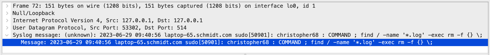
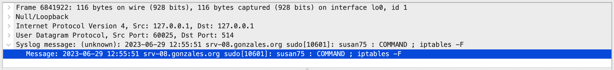
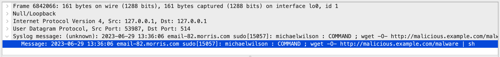
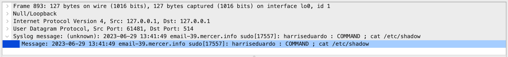
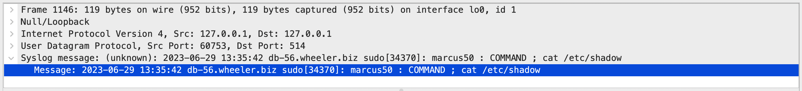
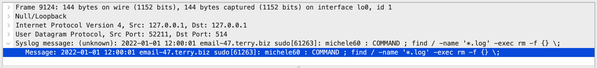
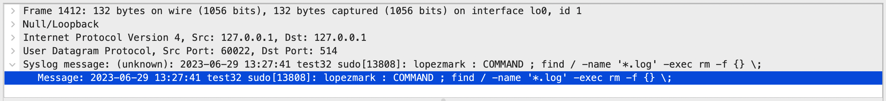

[]()
[](https://www.python.org/)
[](https://fastapi.tiangolo.com/)
[](https://graphql.org/)
[](https://hub.docker.com/repository/docker/aymanam/rosetta)
[]()
[](https://snyk.io/test/github/my-soc/Rosetta)

[](https://go-rosetta.slack.com)

 

# XLog
XLog is a tool to help you generate synthetic log messages. The main interface to the tool is a GraphQL API service with query capabilities to automate the following:
- Fake log messages in different formats.
- Run a worker to send those messages to your detection tools.
***
## Usage
You can run XLog in several ways:

### Option (1) - Installation
- Clone the repository.
- Install the required packages using `pip install -r requirements.txt`. 
- Start the server using  `uvicorn app.main:app --host 0.0.0.0 --port 8000 --reload.`

### Option (2) - Run Your Container
- Build the image `docker build -t xlog`
- Run the image `docker run --name xlog -p 8000:8000 -d rosetta`

### Option (3) - Run a Ready Container
- You can run a ready container: `docker run --name xlog -p 8000:8000 -d aymanam/xlog:latest`
***
## Available Queries
You can use the built-in GraphiQL in-browser tool `http://[xlog-address]:[port]` for writing, validating, and
testing your GraphQL queries. Type queries into this side of the screen, and you will see intelligent typeaheads aware of the current GraphQL type schema and live syntax and  validation errors highlighted within the text.
You can also click on the Explorer page to view a list of the available queries.

With all the queries, you can pass a dict of observables if you want Xlog to use those observables in the synthetic log messages, you can include the following observables in your dict:
- src_ip
- dst_ip
- src_host
- dst_host
- src_domain
- dst_domain
- sender_email
- recipient_email
- email_subject
- email_body
- url
- port
- protocol
- inbound_bytes
- outbound_bytes
- app
- os
- user
- cve
- file_name
- file_hash
- cmd
- process
- technique
- entry_type
- severity
- sensor
- action
- event_id
- error_code
- terms
- incident_types
- analysts

### Synthetic Log Generator
`generateFakeData` query can be used to generate fake logs in different log formats.

The simplest query to generate random syslog message, the message represent a fake risky command execution on a unix server.

**A curl example:**
```bash
curl --location 'http://localhost:8000' \
--header 'Content-Type: application/json' \
--data '{"query":"query MyQuery ($type: FakerTypeEnum!) {\n  generateFakeData(requestInput: {type: $type}) {\n    count\n    data\n    type\n  }\n}","variables":{"type":"SYSLOG"}}'
```
Example output:
```json
{
    "data": {
        "generateFakeData": {
            "count": 1,
            "data": [
                "Jun 27 09:18:52 web-23.stokes.com sudo[7907]: scottchristopher : COMMAND ; chmod -R 777 /"
            ],
            "type": "FakerTypeEnum.SYSLOG"
        }
    }
}
```
You can use the type to CEF, LEEF, JSON, WINEVENT or Incident, examples of each type:

- **CEF**
```json
{
    "data": {
        "generateFakeData": {
            "count": 1,
            "data": [
                "CEF:0|XLog|None|1.0.8|2407d200-1da2-47bb-957d-5353d8d13a55|2023-07-01 07:54:27.392900|4|src_ip=84.196.134.193 src_port=47512 dst_ip=['110.179.127.163'] dst_port=64901 proto=TCP rule=8 act=Deny"
            ],
            "type": "FakerTypeEnum.CEF"
        }
    }
}
```
- **LEEF**
```json
{
    "data": {
        "generateFakeData": {
            "count": 1,
            "data": [
                "LEEF:1.0|XLog|None|1.0.9|deviceEventDate=2023-07-01 07:35:12.066061|212.152.209.198|email-22.smith-hansen.com|src_ip=58.244.8.75 src_port=28926 request_url=https://example.com/user/profile.php?id=1234' OR 1=1 --&password=pass protocol=RTP status=403 action=Deny severity=3"
            ],
            "type": "FakerTypeEnum.LEEF"
        }
    }
}
```
- **WINEVENT**
```json
{
    "data": {
        "generateFakeData": {
            "count": 1,
            "data": [
                "<Event xmlns=\"http://schemas.microsoft.com/win/2004/08/events/event\"><System><Provider Name=\"Microsoft-Windows-Security-Auditing\" Guid=\"88e230d4-38a6-4820-a5c6-ae3f5cab397e\"/><EventID>4624</EventID><Version>0</Version><Level>0</Level><Task>12544</Task><Opcode>0</Opcode><Keywords>0x8020000000000000</Keywords><TimeCreated SystemTime=\"2023-07-01 08:01:28.515343\"/><EventRecordID>863</EventRecordID><Correlation/><Execution ProcessID=\"8458\" ThreadID=\"2091\" Channel=\"Security\"/><Computer>db-20.reynolds-carr.net</Computer><Security UserID=\"S-1-4043\"/><EventData><Data Name=\"SubjectUserSid\">S-1-4043</Data><Data Name=\"SubjectUserName\">martin06</Data><Data Name=\"SubjectDomainName\">decker.com</Data><Data Name=\"SubjectLogonId\">S-1-4043</Data><Data Name=\"LogonType\">3</Data><Data Name=\"TargetUserSid\">S-1-4043</Data><Data Name=\"TargetUserName\">martin06</Data><Data Name=\"TargetDomainName\">decker.com</Data><Data Name=\"ProcessName\">services.exe</Data><Data Name=\"ProcessId\">8458</Data><Data Name=\"DestinationLogonId\">1655</Data><Data Name=\"SourceNetworkAddress\">172.31.76.116</Data><Data Name=\"SourcePort\">13019</Data><Data Name=\"LogonGuid\">88e230d4-38a6-4820-a5c6-ae3f5cab397e</Data><Data Name=\"TransmittedServices\">Soldier national available.</Data></EventData></Event>"
            ],
            "type": "FakerTypeEnum.WINEVENT"
        }
    }
}
```
- **JSON**
```json
{
    "data": {
        "generateFakeData": {
            "count": 1,
            "data": [
                {
                    "vendor": "XLog",
                    "product": null,
                    "version": "1.0.2",
                    "timestamp": "2023-07-01 07:57:25",
                    "severity": 3,
                    "host": "lt-92.murphy.info",
                    "user": "michellesolis"
                }
            ],
            "type": "FakerTypeEnum.JSON"
        }
    }
}
```
- **Incident**
```json
{
    "data": {
        "generateFakeData": {
            "count": 1,
            "data": [
                {
                    "id": 1,
                    "type": "Account Compromised",
                    "duration": 3,
                    "analyst": "Mark"
                }
            ],
            "type": "FakerTypeEnum.Incident"
        }
    }
}
```
#### Using _Vendor_ Input
***
You can use the vendor input with CEF, LEEF, JSON and Incident.

**A curl example:**

```bash
curl --location 'http://localhost:8000' \
--header 'Content-Type: application/json' \
--data '{"query":"query MyQuery ($type: FakerTypeEnum!, $vendor: String!) {\n  generateFakeData(requestInput: {type: $type, vendor: $vendor}) {\n    count\n    data\n    type\n  }\n}","variables":{"type":"JSON","vendor":"TestVendor"}}'
```
Example output:
```json
{
    "data": {
        "generateFakeData": {
            "count": 1,
            "data": [
                {
                    "vendor": "TestVendor",
                    "product": null,
                    "version": "1.0.3",
                    "timestamp": "2023-07-01 08:11:08",
                    "severity": 4,
                    "host": "lt-45.brown.com",
                    "user": "johnsonsusan"
                }
            ],
            "type": "FakerTypeEnum.JSON"
        }
    }
}
```
#### Using _Product_ Input
***
You can use the Product input with CEF, LEEF, JSON and Incident.

**A curl example:**

```bash
curl --location 'http://localhost:8000' \
--header 'Content-Type: application/json' \
--data '{"query":"query MyQuery ($type: FakerTypeEnum!, $product: String!) {\n  generateFakeData(requestInput: {type: $type, product: $product}) {\n    count\n    data\n    type\n  }\n}","variables":{"type":"LEEF","product":"TestProduct"}}'
```
Example output:
```json
{
    "data": {
        "generateFakeData": {
            "count": 1,
            "data": [
                "LEEF:1.0|XLog|TestProduct|1.0.0|deviceEventDate=2023-07-01 08:54:32.034841|209.4.252.251|web-63.ryan.com|src_ip=197.193.74.111 src_port=15358 request_url=https://example.com/user/profile.php?id=1234' OR 1=1 --&password=pass protocol=TCP status=200 action=Log severity=5"
            ],
            "type": "FakerTypeEnum.LEEF"
        }
    }
}
```
#### Using _Version_ Input
***
You can use the Version input with CEF, LEEF, JSON and Incident.

**A curl example:**

```bash
curl --location 'http://localhost:8000' \
--header 'Content-Type: application/json' \
--data '{"query":"query MyQuery ($type: FakerTypeEnum!, $version: String!) {\n  generateFakeData(requestInput: {type: $type, version: $version}) {\n    count\n    data\n    type\n  }\n}","variables":{"type":"LEEF","version":"5.0"}}'
```
Example output:
```json
{
    "data": {
        "generateFakeData": {
            "count": 1,
            "data": [
                "LEEF:1.0|XLog|None|5.0|deviceEventDate=2023-07-01 08:55:06.086069|102.95.16.18|web-54.pruitt.net|src_ip=8.41.164.245 src_port=3131 request_url=https://example.com/search.php?q=<script>alert('xss')</script> protocol=HTTP status=403 action=Drop severity=4"
            ],
            "type": "FakerTypeEnum.LEEF"
        }
    }
}
```
#### Using _Timestamp_ Input
***
If you want to set a timestamp to start from, you can set the timestamp input to a datatime formatted string, example "2022-01-01 12:00:00". You can use the timestamp input with Syslog, CEF, LEEF, WINEVENT, JSON and Incident.

**A curl example:**

```bash
curl --location 'http://localhost:8000' \
--header 'Content-Type: application/json' \
--data '{"query":"query MyQuery ($type: FakerTypeEnum!, $timestamp: String!) {\n  generateFakeData(requestInput: {type: $type, timestamp: $timestamp}) {\n    count\n    data\n    type\n  }\n}","variables":{"type":"CEF","timestamp":"2022-01-01 12:00:00"}}'
```
Example output:
```json
{
    "data": {
        "generateFakeData": {
            "count": 1,
            "data": [
                "CEF:0|XLog|None|1.0.6|a01afc79-31c9-44d9-8143-9e2ee4d24b62|2022-01-01 12:00:01|3|src_ip=2.149.95.67 src_port=53236 dst_ip=['101.3.143.177'] dst_port=44855 proto=SSL rule=98 act=Deny"
            ],
            "type": "FakerTypeEnum.CEF"
        }
    }
}
```
#### Using _Count_ Input
***
If you want to fake multiple log entries, you can set the count input to an int. You can use the count input with Syslog, CEF, LEEF, WINEVENT, JSON and Incident.
** A curl example:**
```bash
curl --location 'http://localhost:8000' \
--header 'Content-Type: application/json' \
--data '{"query":"query MyQuery ($type: FakerTypeEnum!, $count: Int!) {\n  generateFakeData(requestInput: {type: $type, count: $count}) {\n    count\n    data\n    type\n  }\n}","variables":{"type":"WINEVENT","count":3}}'
```
Example output:
```json
{
    "data": {
        "generateFakeData": {
            "count": 3,
            "data": [
                "<Event xmlns=\"http://schemas.microsoft.com/win/2004/08/events/event\"><System><Provider Name=\"Microsoft-Windows-Security-Auditing\" Guid=\"368e76d6-e74a-4343-8f60-b97ec4cd83d5\"/><EventID>4648</EventID><Version>0</Version><Level>0</Level><Task>13824</Task><Opcode>0</Opcode><Keywords>0x8020000000000000</Keywords><TimeCreated SystemTime=\"2023-07-01 09:20:18.312391\"/><EventRecordID>144</EventRecordID><Correlation/><Execution ProcessID=\"4132\" ThreadID=\"6421\" Channel=\"Security\"/><Computer>web-17.carter.com</Computer><Security UserID=\"S-1-6214\"/><EventData><Data Name=\"SubjectUserSid\">S-1-6214</Data><Data Name=\"SubjectUserName\">robersontim</Data><Data Name=\"SubjectDomainName\">mejia-gomez.biz</Data><Data Name=\"SubjectLogonId\">S-1-6214</Data><Data Name=\"NewProcessId\">8893</Data><Data Name=\"ProcessId\">4132</Data><Data Name=\"CommandLine\">wmic.exe /namespace:\\root\\cimv2 path Win32_Account</Data><Data Name=\"TargetUserSid\">S-1-6214</Data><Data Name=\"TargetUserName\">robersontim</Data><Data Name=\"TargetDomainName\">mejia-gomez.biz</Data><Data Name=\"TargetLogonId\">S-1-6214</Data><Data Name=\"LogonType\">3</Data></EventData></Event>",
                "<Event xmlns=\"http://schemas.microsoft.com/win/2004/08/events/event\"><System><Provider Name=\"Microsoft-Windows-Sysmon\" Guid=\"d888ca8b-3750-4bd2-876b-4c5ae4b87448\"/><EventID>10</EventID><Version>5</Version><Level>4</Level><Task>10</Task><Opcode>0</Opcode><Keywords>0x8000000000000000</Keywords><TimeCreated SystemTime=\"2023-07-01 09:20:19.312391\"/><EventRecordID>138</EventRecordID><Correlation/><Execution ProcessID=\"5705\" ThreadID=\"2024\" Channel=\"Microsoft-Windows-Sysmon/Operational\"/><EventData><Data Name=\"TargetImage\">C:\\Windows\\System32\\calc.exe</Data><Data Name=\"TargetPID\">5836</Data></EventData></Event>",
                "<Event xmlns=\"http://schemas.microsoft.com/win/2004/08/events/event\"><System><Provider Name=\"Microsoft-Windows-Security-Auditing\" Guid=\"237c3186-d40d-4595-99d4-09d15063c5f0\"/><EventID>4672</EventID><Version>0</Version><Level>0</Level><Task>12544</Task><Opcode>0</Opcode><Keywords>0x8020000000000000</Keywords><TimeCreated SystemTime=\"2023-07-01 09:20:20.312391\"/><EventRecordID>868</EventRecordID><Correlation/><Execution ProcessID=\"6909\" ThreadID=\"2523\" Channel=\"Security\"/><Computer>db-42.rodriguez-jordan.biz</Computer><Security UserID=\"S-1-8484\"/><EventData><Data Name=\"SubjectUserSid\">S-1-8484</Data><Data Name=\"SubjectUserName\">smithethan</Data><Data Name=\"SubjectDomainName\">grant.com</Data><Data Name=\"SubjectLogonId\">7450</Data><Data Name=\"PrivilegeList\">From glass alone.</Data></EventData></Event>"
            ],
            "type": "FakerTypeEnum.WINEVENT"
        }
    }
}
```

#### Using _Observables_ Input
***
If you want to set an Observables list to pick from. You can use this input with SYSLOG, CEF, LEEF, WINEVENT, JSON, and Incident. The WINEVENT logs currently support only the following observables:
- event_id
- process
- src_host
- user
- cmd
- src_ip
- file_name

**A curl example:**
```bash
curl --location 'http://localhost:8000' \
--header 'Content-Type: application/json' \
--data '{"query":"query MyQuery ($type: FakerTypeEnum!, $observablesDict: JSON!) {\n  generateFakeData(requestInput: {type: $type, observablesDict: $observablesDict}) {\n    count\n    data\n    type\n  }\n}","variables":{"type":"LEEF","observablesDict":{"src_ip":["1.1.1.1","2.2.2.2"],"error_code":["200"],"technique":[{"indicator":"https://www.example.org/auth","mechanism":"POST"}]}}}'
```
Example output:
```json
{
    "data": {
        "generateFakeData": {
            "count": 1,
            "data": [
                "LEEF:1.0|XLog|None|1.0.1|deviceEventDate=2023-07-01 08:11:03.339443|95.1.218.82|email-19.logan.info|src_ip=1.1.1.1 src_port=10018 request_url=https://www.example.org/auth protocol=UDP status=200 action=Deny severity=1 src_ip=1.1.1.1 technique={'indicator': 'https://www.example.org/auth', 'mechanism': 'POST'} error_code=200"
            ],
            "type": "FakerTypeEnum.LEEF"
        }
    }
}
```
#### Using _Fields_ Input
***
The Fields input is only available with the Incident type. The following fields are supported:
- id
- duration
- type
- analyst
- severity
- description
- events

The events field will allow you to include all different types of logs with the generated incident.

- ** A curl example:**
```bash
curl --location 'http://localhost:8000' \
--header 'Content-Type: application/json' \
--data '{"query":"query MyQuery ($type: FakerTypeEnum!, $observablesDict: JSON!, $fields: String!, $timestamp: String!) {\n  generateFakeData(requestInput: {type: $type, observablesDict: $observablesDict, fields:$fields, timestamp: $timestamp}) {\n    count\n    data\n    type\n  }\n}","variables":{"type":"Incident","observablesDict":{"incident_types":["phishing","malware"],"src_host":["host1","host2"]},"fields":"id,type,duration,analyst,severity,description,events","timestamp":"2022-01-01 12:00:00"}}'
```
Example output:
```json
{
    "data": {
        "generateFakeData": {
            "count": 1,
            "data": [
                {
                    "id": 1,
                    "duration": 2,
                    "type": "malware",
                    "analyst": "Margaret",
                    "severity": 5,
                    "description": "Event Triggered Execution: Windows Management Instrumentation Event Subscription Hide Artifacts: Process Argument Spoofing System Binary Proxy Execution: Rundll32 Phishing for Information: Spearphishing Service Create or Modify System Process: Windows Service Acquire Infrastructure: Botnet.",
                    "events": [
                        {
                            "event": "2022-01-01 12:00:01 host2 sudo[47191]: kararogers : COMMAND ; dd if=/dev/zero of=/dev/sda"
                        },
                        {
                            "event": "CEF:0|XLog|None|1.0.3|05a4f070-4aae-4b29-8729-c3422a24076e|2022-01-01 12:00:01|3|src_ip=163.62.103.47 src_port=23158 dst_ip=['122.116.230.172'] dst_port=43234 proto=RTP rule=157 act=Deny src_host=host2 incident_types=malware"
                        },
                        {
                            "event": "LEEF:1.0|XLog|None|1.0.3|deviceEventDate=2022-01-01 12:00:01|60.64.201.117|host1|src_ip=158.143.53.183 src_port=10339 request_url=https://example.com/assets/jquery-1.11.1.js protocol=RTP status=500 action=Wait severity=3 src_host=host2 incident_types=malware"
                        },
                        {
                            "event": "<Event xmlns=\"http://schemas.microsoft.com/win/2004/08/events/event\"><System><Provider Name=\"Microsoft-Windows-Security-Auditing\" Guid=\"8cf17663-830d-4495-a237-440b3c619548\"/><EventID>4688</EventID><Version>0</Version><Level>0</Level><Task>13312</Task><Opcode>0</Opcode><Keywords>0x8020000000000000</Keywords><TimeCreated SystemTime=\"2022-01-01 12:00:01\"/><EventRecordID>122</EventRecordID><Correlation/><Execution ProcessID=\"5613\" ThreadID=\"6919\" Channel=\"Security\"/><Computer>host1</Computer><Security UserID=\"S-1-5970\"/><EventData><Data Name=\"SubjectUserSid\">S-1-5970</Data><Data Name=\"SubjectUserName\">megangill</Data><Data Name=\"SubjectDomainName\">richards.org</Data><Data Name=\"SubjectLogonId\">S-1-5970</Data><Data Name=\"NewProcessId\">9692</Data><Data Name=\"CreatorProcessId\">5613</Data><Data Name=\"TokenElevationType\">TokenElevationTypeLimited (3)</Data><Data Name=\"ProcessCommandLine\">Import-Module PowerSploit; Get-GPPPassword</Data>"
                        },
                        {
                            "event": {
                                "vendor": "XLog",
                                "product": null,
                                "version": "1.0.5",
                                "timestamp": "2022-01-01 12:00:01",
                                "severity": 4,
                                "host": "host2",
                                "user": "lozanojerry",
                                "src_host": "host1",
                                "incident_types": "phishing"
                            }
                        }
                    ]
                }
            ],
            "type": "FakerTypeEnum.Incident"
        }
    }
}
```


***

### Synthetic Log Sender
`dataWorkerCreate` query can be used to create a new worker to send the faked logs to a destination detection tool.

#### 1.1 - Create a UDP Worker 
You can use the UDP worker for sending generic Syslog, CEF and LEEF Messages.
***
The simplest query to generate random syslog message and sending to over UDP.

##### A curl example:
```bash
curl --location 'http://localhost:8000' \
--header 'Content-Type: application/json' \
--data '{"query":"query MyQuery($type: WorkerTypeEnum!, $destination: String!, $count: Int!, $interval: Int!) {\n    dataWorkerCreate(requestInput: {type: $type, destination: $destination, count: $count, interval: $interval}) {\n        worker\n        type\n        status\n        count\n        interval\n        destination\n        createdAt\n  }\n}","variables":{"type":"SYSLOG","destination":"udp:127.0.0.1:514","count":5,"interval":2}}'
```
Example output:
```json
{
    "data": {
        "dataWorkerCreate": {
            "worker": "worker_20230629095100",
            "type": "SYSLOG",
            "status": "Running",
            "count": "4",
            "interval": "2",
            "destination": "udp:127.0.0.1:514",
            "createdAt": "2023-06-29 09:51:00.626856"
        }
    }
}
```
#### 1.1 - Create a UDP Worker 
***
The simplest query to generate random syslog message and sending to over UDP.

##### A curl example:
```bash
curl --location 'http://localhost:8000' \
--header 'Content-Type: application/json' \
--data '{"query":"query MyQuery($type: WorkerTypeEnum!, $destination: String!, $count: Int!, $interval: Int!) {\n    dataWorkerCreate(requestInput: {type: $type, destination: $destination, count: $count, interval: $interval}) {\n        worker\n        type\n        status\n        count\n        interval\n        destination\n        createdAt\n  }\n}","variables":{"type":"SYSLOG","destination":"udp:127.0.0.1:514","count":5,"interval":2}}'
```
Example output:
```json
{
    "data": {
        "dataWorkerCreate": {
            "worker": "worker_20230629095100",
            "type": "SYSLOG",
            "status": "Running",
            "count": "4",
            "interval": "2",
            "destination": "udp:127.0.0.1:514",
            "createdAt": "2023-06-29 09:51:00.626856"
        }
    }
}
```
PCAP:

***
***
If you want to fake multiple log entries, you can set the count input to an int.
##### A curl example:

```bash
curl --location 'http://localhost:8000' \
--header 'Content-Type: application/json' \
--data '{"query":"query MyQuery($type: WorkerTypeEnum!, $destination: String!, $count: Int!) {\n    dataWorkerCreate(requestInput: {type: $type, destination: $destination, count: $count}) {\n        worker\n        type\n        status\n        count\n        interval\n        destination\n        createdAt\n  }\n}","variables":{"type":"SYSLOG","destination":"udp:127.0.0.1:514","count":2}}'
```
Example output:
```json
{
    "data": {
        "dataWorkerCreate": {
            "worker": "worker_20230629134154",
            "type": "SYSLOG",
            "status": "Running",
            "count": "1",
            "interval": "2",
            "destination": "udp:127.0.0.1:514",
            "createdAt": "2023-06-29 13:41:54.660233"
        }
    }
}
```
PCAP:


***
***
If you want to fake set the interval between sent log entries, you can set the interval input to an int.
##### A curl example:

```bash
curl --location 'http://localhost:8000' \
--header 'Content-Type: application/json' \
--data '{"query":"query MyQuery($type: WorkerTypeEnum!, $destination: String!, $interval: Int!, $count: Int!) {\n    dataWorkerCreate(requestInput: {type: $type, destination: $destination, count: $count, interval: $interval}) {\n        worker\n        type\n        status\n        count\n        interval\n        destination\n        createdAt\n  }\n}","variables":{"type":"SYSLOG","destination":"udp:127.0.0.1:514","count":2,"interval":5}}'
```
Example output:
```json
{
    "data": {
        "dataWorkerCreate": {
            "worker": "worker_20230629135734",
            "type": "SYSLOG",
            "status": "Running",
            "count": "1",
            "interval": "5",
            "destination": "udp:127.0.0.1:514",
            "createdAt": "2023-06-29 13:57:34.940563"
        }
    }
}
```
PCAP:


***
***
If you want to set a timestamp to start from, you can set the timestamp input to a datatime formatted string, example "2022-01-01 12:00:00".
##### A curl example:

```bash
curl --location 'http://localhost:8000' \
--header 'Content-Type: application/json' \
--data '{"query":"query MyQuery($type: WorkerTypeEnum!, $destination: String!, $timestamp: String!) {\n    dataWorkerCreate(requestInput: {type: $type, destination: $destination, timestamp: $timestamp}) {\n        worker\n        type\n        status\n        count\n        interval\n        destination\n        createdAt\n  }\n}","variables":{"type":"SYSLOG","destination":"udp:127.0.0.1:514","timestamp":"2022-01-01 12:00:00"}}'
```
Example output:
```json
{
    "data": {
        "dataWorkerCreate": {
            "worker": "worker_20230629140330",
            "type": "SYSLOG",
            "status": "Running",
            "count": "0",
            "interval": "2",
            "destination": "udp:127.0.0.1:514",
            "createdAt": "2023-06-29 14:03:30.748572"
        }
    }
}
```
PCAP:

***
***
If you want to set an observables object, you can use the observablesDict input, below are all the types of observables that you can use in your dict, please review the supported observables for each log type:
- incident_types
- analysts
- severity
- terms
- src_host
- user
- process
- cmd
- dst_ip
- protocol
- url
- port
- action
- event_id
- src_ip
- file_hash
- technique
- error_code
- file_name
- cve
##### A curl example:

```bash
curl --location 'http://localhost:8000' \
--header 'Content-Type: application/json' \
--data '{"query":"query MyQuery($type: WorkerTypeEnum!, $destination: String!, $observablesDict: JSON!) {\n    dataWorkerCreate(requestInput: {type: $type, destination: $destination, observablesDict: $observablesDict}) {\n        worker\n        type\n        status\n        count\n        interval\n        destination\n        createdAt\n  }\n}","variables":{"type":"SYSLOG","destination":"udp:127.0.0.1:514","observablesDict":{"src_host":["test12","test32"]}}}'
```
Example output:
```json
{
    "data": {
        "dataWorkerCreate": {
            "worker": "worker_20230629141531",
            "type": "SYSLOG",
            "status": "Running",
            "count": "0",
            "interval": "2",
            "destination": "udp:127.0.0.1:514",
            "createdAt": "2023-06-29 14:15:31.069035"
        }
    }
}
```
PCAP:

***
***
#### 1.2 - Create a TCP Worker 
You can use the TCP worker for sending generic Syslog, CEF and LEEF Messages.
***
You can use same query options that include count, interval, timestamp and observables; Please refer to the above examples.
##### A curl example:

```bash
curl --location 'http://localhost:8000' \
--header 'Content-Type: application/json' \
--data '{"query":"query MyQuery($type: WorkerTypeEnum!, $destination: String!, $count: Int!, $interval: Int!) {\n    dataWorkerCreate(requestInput: {type: $type, destination: $destination, count: $count, interval: $interval}) {\n        worker\n        type\n        status\n        count\n        interval\n        destination\n        createdAt\n  }\n}","variables":{"type":"SYSLOG","destination":"tcp:127.0.0.1:514","count":5,"interval":2}}'
```
Example output:
```json
{
    "data": {
        "dataWorkerCreate": {
            "worker": "worker_20230629140642",
            "type": "SYSLOG",
            "status": "Running",
            "count": "4",
            "interval": "2",
            "destination": "tcp:127.0.0.1:514",
            "createdAt": "2023-06-29 14:06:42.089409"
        }
    }
}
```
***
#### 1.2 - Create a Webhook Worker 
You can use the Webhook worker for sending JSON and Incident Messages.
***
You can use same query options that include count, interval, timestamp, observables, fields and verify_ssl; Please refer to the above examples.
##### A curl example:

```bash
curl --location 'http://localhost:8000' \
--header 'Content-Type: application/json' \
--data '{"query":"query MyQuery($type: WorkerTypeEnum!, $destination: String!, $count: Int!, $interval: Int!,$fields: String!) {\n    dataWorkerCreate(requestInput: {type: $type, destination: $destination, count: $count, interval: $interval, fields: $fields}) {\n        worker\n        type\n        status\n        count\n        interval\n        destination\n        verifySsl\n        createdAt\n  }\n}","variables":{"type":"JSON","destination":"https://webhook-service.local","count":3,"interval":2,"fields":"id,type,duration,analyst,severity,description,events"}}'
```
Example output:
```json
{
    "data": {
        "dataWorkerCreate": {
            "worker": "worker_20230629144632",
            "type": "JSON",
            "status": "Running",
            "count": "2",
            "interval": "2",
            "destination": "https://webhook-service.local",
            "verifySsl": "False",
            "createdAt": "2023-06-29 14:46:32.622369"
        }
    }
}
```
***